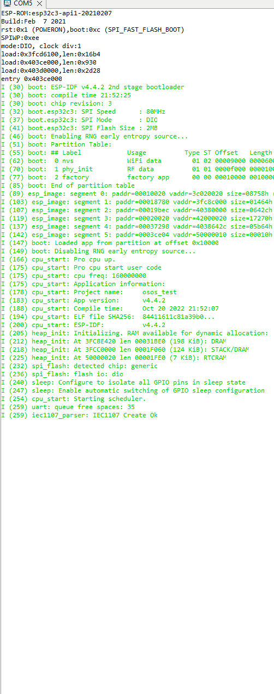

<a href="https://buymeacoffee.com/vvolkanunas" target="_blank"></a>

# What is esp32-iec62056-component

esp32-iec62056-component is a pure C esp-idf component for ESP32 that allows reading electricity meters with optical eye.

## Example

The project **example** contains one source file in C language [main.c](main/main.c). The file is located in folder [main](main).

## List of events
*  IEC1107_PROTOCOL_ERROR
*  IEC1107_START_MESSAGE_NOT_SENDED
*  IEC1107_START_MESSAGE_SENDED
*  IEC1107_START_MESSAGE_NOT_RECIEVED
*  IEC1107_START_MESSAGE_RECEIVED
*  IEC1107_READOUT_MESSAGE_SENDED
*  IEC1107_READOUT_MESSAGE_NOT_RECEIVED
*  IEC1107_READOUT_MESSAGE_RECEIVED
*  IEC1107_FIELDS_UPDATED

## When you adding esp32-iec62056-component to your code 
```
#include "iec1107.h"
```

Add this two line
```
extern export_values_t* export_hdl;
extern const int export_params_size;
```

Event handler function 
```
static void iec1107_event_handler(void* event_handler_arg, esp_event_base_t event_base, int32_t event_id, void* event_data)
{
  switch(event_id)
  {
  case IEC1107_PROTOCOL_ERROR:
    ESP_LOGI("Event Handler", "IEC1107_PROTOCOL_ERROR");
    break;
  case IEC1107_START_MESSAGE_NOT_RECIEVED:
    ESP_LOGI("Event Handler", "IEC1107_START_MESSAGE_NOT_RECIEVED");
    break;
  case IEC1107_START_MESSAGE_NOT_SENDED:
    ESP_LOGI("Event Handler", "IEC1107_START_MESSAGE_NOT_SENDED");
    break;
  case IEC1107_START_MESSAGE_SENDED:
     ESP_LOGI("Event Handler", "IEC1107_START_MESSAGE_SENDED");
    break;
  case IEC1107_START_MESSAGE_RECEIVED:
    ESP_LOGI("Event Handler", "SIEC1107_START_MESSAGE_RECEIVED");
    break;
  case IEC1107_READOUT_MESSAGE_SENDED:
    ESP_LOGI("Event Handler", "IEC1107_READOUT_MESSAGE_SENDED");
    break;
  case IEC1107_READOUT_MESSAGE_NOT_RECEIVED:
    ESP_LOGI("Event Handler", "IEC1107_READOUT_MESSAGE_NOT_RECEIVED");
    break;
  case IEC1107_READOUT_MESSAGE_RECEIVED:
    ESP_LOGI("Event Handler", "IEC1107_READOUT_MESSAGE_RECEIVED");
    break;
  case IEC1107_FIELDS_UPDATED:
    print_exported_fields();
    ESP_LOGI("Event Handler", "IEC1107_FIELDS_UPDATED");
    break;

  default:
    break;
  }
}
```


Our main
```
void app_main()
{
  iec1107_parser_handle_t iec1107 = iec1107_parser_init(LOOP, 1000);

  iec1107_parser_add_handler(iec1107, iec1107_event_handler, NULL);

  iec1107_start(iec1107);
}
```

## Adding obis code

You can edit `export_obis_code` [config.h](components/iec1107/include/config.h)
Example : 
```
const char* export_obis_code[] =
{
    "32.7.0",
    "1.8.0",
    "34.7.0",
    "96.77.2*1",
};
```

I will calculate the values using the order found above. You can access these values through this struct. `export_hdl` We have already defined it in [main.c](main/main.c). 

For examle above `export_obis_code`                                                                 

When the reading from the meter is finished. All values are placed in the export_hdl variable. If you want to access the value of 32.7.0.
`export_hdl -> export_holder[0]` It holds this value.


